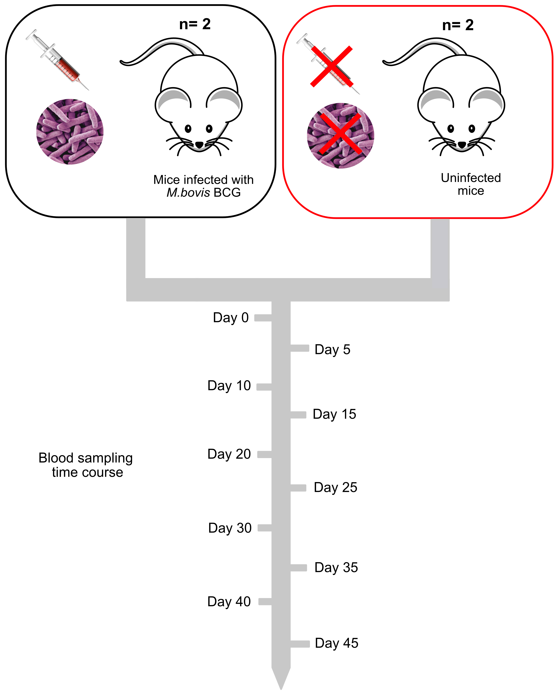

# RNAseq experiment investigating the blood transcriptome

In the experiment outlined in the figure below, a group is interested in identifying differentially expressed genes (DEGs) that occur when mice are injected with an attenuated version of the causative agent of tuberculosis, *Mycobacterium bovis*, with a BCG injection. In order to identify DEGs they have decided on the following experimental plan.

They want to look at differences between uninfected and infected mice, so they have a control group of uninfected mice and an infected group . In each group there are two individuals. They are concerned about having replicates, but these mice are both the same strain and have been raised within a controlled environment, so they think there will not be significant variation between individuals in the same group. Instead they are going to take blood samples at 5 day intervals from day 0 to day 45 of infection. In total they will have 10 replicates from these individual mice.

The lab has a small budget for the experiment and so they are aiming to get a depth of coverage of ~20x based on the size of the mouse genome.  

## Looking at the following experimental design we are going to think about the following few questions

- How to we feel about the level of replication observed in the experimental design?
- Do we think there will be enough power in the data to identify DEGs?
- How do we feel about the depth of sequencing?
- Do we think we will be able to look at both the transcriptome over time and the comparision between uninfected and infected samples?
- How would you improve the design?
