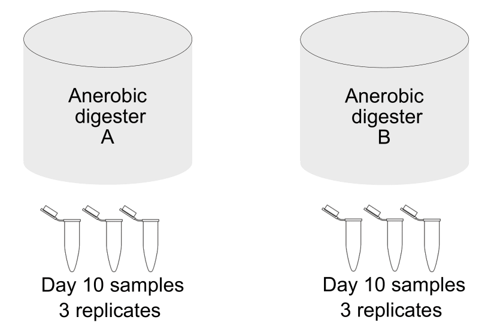
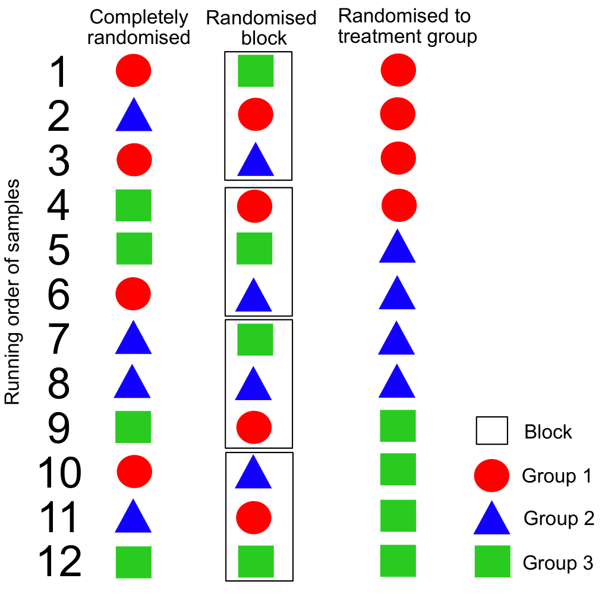

# Metabolomics data from anerobic digestion

The following experimental design is shown below. In this experiment metabolite samples were prepared from sewage sludge which has been taken from anaerobic digesters. Anaerobic digestion is the process of using microbes to break down organic material to generate biogas which can be used as a renewable energy source. The samples are prepared to use on a mass spectrometer, which will generate an abundance and the charge/mass ratio for each metabolite it detects. Generating this metabolomic data, or generating other datasets on mass spectrometers often requires liquid chromatography prior to the mass spectrometer, hence you may have heard proteomic/metabolomic data referred to as LCMS data (Liquid chromatography mass spectrometry). Due to the metabolites in this case, or digested proteins in proteomic data, being seperated through liquid chromatography first, we have additional experimental design concerns to consider compared to seqeuncing based experiments.

**When we have covered the information below on considerations for experimental design think about how you could use this experiment to design the run order of samples. What samples would you use to make the QCs for the samples?**

## Interbatch variation in mass spectrometry

There is greater interbatch variation with LCMS data and a higher level of background noise. This is partly due to all samples and the solvent having to be injected and passed through one chromatography column prior to ionisation. This increases the occurance of contamination between samples. To circumvent this, before samples are injected, the column is conditioned by using multiple rounds of QC/ control samples first, followed by multiple rounds of blanks. This can vary by machine, however for use on the Orbitrap mass spectrometer you would typically perform 15 injections of a QC, followed by 7 blanks, followed by additional QC injections prior to the first samples. This should try and minimise anything bound to the column from previous experiments. Over time there is drift that occurs, which can reduce the accuracy of the quantification. To reduce both the carryover contamination, and to reduce drift, QC samples are injected every 7 samples to allow for normalisation of peaks in the analysis downstream.

### QC sample pooling

There are several methods for quantifying peak intensity in mass spectrometry data. You can inject samples with metabolites of a known concentration and structure to normalise concentration of unknown peaks. Here we are mentioning pooled sample QCs.  These are literally a pool of all samples ran. These do not give you an identity, but they are used to normalise samples and can be used to reduce background noise and contaminants that may be in individual samples. Mass spectrometry is not inheritantly quantitive unless you have a calibration against a known quantity as mentioned above. There are different methods to do this, and labelling strategies. However we will not be covering these today. As with sequencing, we are typically more concerned with the relative abundance of metabolites.

## Randomisation of sample order

Due to the samples in a mass spec experiment being ran in blocks between QCs, it is important to know how this effects the run order. Randomisation in blocks is important. Complete randomisation can result in drift due to accidental severe imbalances in run order. Randomising in blocks rather than completely, or within groups will also reduce drit and between batch variation. Examples of how this would work for an experiment with 12 samples in 3 groups with four replicates is shown in the beneath figure.  

## Additional information

The following paper more fully describes why block randomisation is important for proteomic experiments. The same principles apply for metabolomics experiments which are also ran on a mass spectrometer [see here](https://pubs.acs.org/doi/10.1021/acs.jproteome.0c00536).

[This paper](https://www.nature.com/articles/s41596-021-00566-6#Sec23) based on clinical studies used for biomarker discovery also goes into much greater detail about mass spec experiments, the best practices and considerations are for ensuring there is enough power in your dataset. It also goes into experimental design, including the importan of randomised block design. There is also additional content on the different points between experimental planning to data analysis where bias can be introduced into your experiment that you need to consider.

The batch effects discussed above and a dicussion of the tools and algorithms used to counterract this in the data are also included in [this review](https://analyticalsciencejournals.onlinelibrary.wiley.com/doi/full/10.1002/mas.21672) in more depth.
