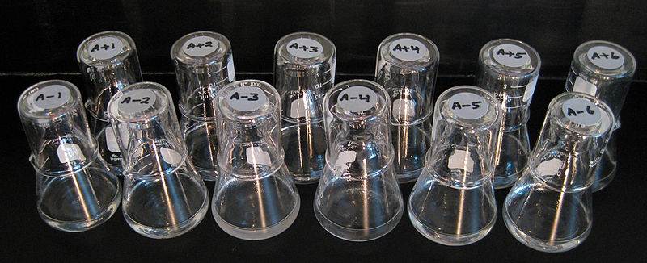

# The long-term evolution experiment
[The long-term evolution experiment (LTEE)](https://en.wikipedia.org/wiki/E._coli_long-term_evolution_experiment), led by Richard Lenski, started in 1988 and tracks the evolution of twelve, initally identical, populations of _E. coli_. These populations have reached over 75,000 generations.

{:width="800px"}
_Photograph of Richard Lenski's long-term evolution experiment with E. coli taken on 25 June 2008. Each flask harbors one of the 12 evolving populations. The photo was taken about 24 h after the cultures were serially transferred, hence they are at stationary phase. The populations grow in DM25 medium, which contains a relatively low glucose concentration so that the culture is not very turbid. However, one population, designated Ara-3, evolved to use the citrate that is also present in the medium. It has a much greater density of cells than the others, and it is therefore much more turbid, owing to the high concentration of citrate in the medium supporting greater cell growth. By Brian Baer and Neerja Hajela - http://myxo.css.msu.edu/ecoli/citrateflasksphotos.html, CC BY-SA 1.0, https://commons.wikimedia.org/w/index.php?curid=4277480_

This is an open-ended observational study to investigate:
- The dynamics of evolutionary change
- The repeatability of evolutionary change
- The relationship between genotypic and phenotypic change

The _E. coli_ strain used has particular characteristics that mean that evolution occurs only by the core evolutionary processes of mutation, genetic drift, and natural selection. These are:
- Asexual reproduction
- No plasmids that could permit bacterial conjugation
- No viable [prophage](https://en.wikipedia.org/wiki/Prophage)
Asexuality also means that genetic markers persist in lineages and clades by common descent, but cannot otherwise spread in the populations

The _E. coli_ are grown on glucose-limited medium which cannot support large populations. This limits the chance of two benefical mutations competing against each other (known as clonal interference).

The populations are kept in a 37 degree C incubator and each day 1% of each population is tranferred to a fresh flask of medium. This dilution means that each population as 6.64 generations a day. Representative samples are frozen every 75 days (500 generations) so there is a "frozen fossil record".

The populations are thought to have experience enough spontaneous mutations that every possible point mutation has occured multiple times.
